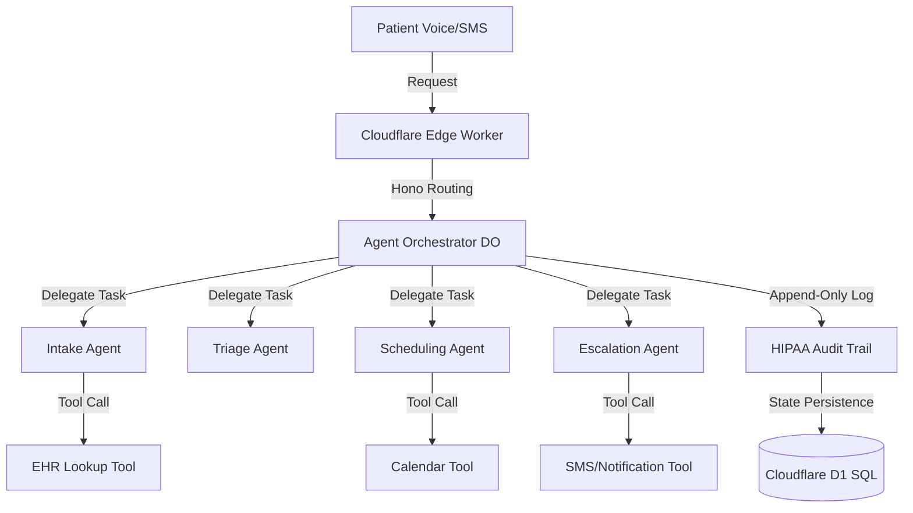

# Zara OS

> The AI-native operating system for independent physician practices.
> Built by a practicing physician serving 10,000+ patients across 24 states.

---

## The thesis

Roughly 250,000 independent physician practices exist in the US. They serve a disproportionate share of underserved, rural, and minority communities. They are closing at 5–8% per year because administrative burden has made solo and small-group practice economically unviable.

The cost of running the back office (scheduling, intake, prior auth, documentation, billing, follow-up, compliance, patient communication) consumes 30–50% of practice revenue. Every one of those workflows is now agent-replaceable.

I'm Dr. Jessica Edwards. I'm a board-certified family medicine physician and the founder of Zara Medical, a 24-state hybrid telehealth practice. In 2025 I deployed an AI receptionist that now handles 70% of inbound calls without human intervention — saving 2+ hours per provider per day. Healthcare IT News covered it in June 2025.

This repository is the foundation of Zara OS: the platform layer underneath Zara Medical, designed to be licensed to every independent practice in the country.

---

## What's in this repo

This is the agent stack that runs production at Zara Medical, extracted and hardened for multi-tenant deployment.

| Module | Status | What it does |
|---|---|---|
| `apps/reception` | ✅ Production | AI receptionist — intake, triage, scheduling, escalation |
| `apps/practice-ops` | 🚧 In development | Prior auth, referral coordination, follow-up |
| `packages/memory` | ✅ Production | Per-patient context layer (HIPAA-compliant) |
| `packages/compliance` | ✅ Production | HIPAA audit logging + access controls |

---

## Architecture

See [ARCHITECTURE.md](./ARCHITECTURE.md) for the full system design.

---

## Why this is built the way it's built

- **Cloudflare Workers + Agents SDK** — edge runtime keeps latency under 200ms for voice flows. See [ADR-001](./docs/ADRs/001-cloudflare-edge-runtime.md).
- **Orchestrator/worker agent pattern** — single supervisor agent routes to specialized workers. See [ADR-002](./docs/ADRs/002-agent-orchestration-pattern.md).
- **Append-only audit log on every action** — HIPAA §164.312 compliance is a first-class architectural concern, not bolted on. See [ADR-003](./docs/ADRs/003-hipaa-audit-trail-architecture.md).
- **Multi-model fallback** — Claude Opus for complex reasoning, Workers AI Llama for routine intake, OpenRouter for cost control. See [ADR-004](./docs/ADRs/004-llm-vendor-selection.md).

---

## Live demo

▶️ [2-minute Loom walkthrough of the AI receptionist handling a real call](https://github.com/rjbizsolution23-wq/zara-os/blob/main/docs/DEMOS/loom-links.md)
▶️ [Healthcare IT News case study, June 2025](https://github.com/rjbizsolution23-wq/zara-os/blob/main/docs/CASE-STUDY-HEALTHCARE-IT-NEWS.md)

---

## Roadmap

| Quarter | Milestone |
|---|---|
| Q3 2025 | ✅ AI receptionist live at Zara Medical |
| Q4 2025 | ✅ SereneSpace.ai mental health integration |
| Q1 2026 | 🚧 Prior-auth agent in alpha |
| Q2 2026 | 🎯 First external pilot practice onboarded |
| Q3 2026 | 🎯 10 practices live on Zara OS |
| Q4 2026 | 🎯 Seed round closed |

---

## About the founder

Dr. Jessica Edwards is a board-certified family medicine physician (DO, MBA), second-generation osteopath, and founder of Zara Medical. She is licensed in 24 states, has treated 10,000+ patients, and holds fellowships in Maternal & Child Health, Health Policy, and Climate Health Equity.

[LinkedIn](https://www.linkedin.com/in/drjessicaedwards/) · [zaramedical.com](https://zaramedical.com) · [Healthcare IT News feature](https://github.com/rjbizsolution23-wq/zara-os/blob/main/docs/CASE-STUDY-HEALTHCARE-IT-NEWS.md)

---

## License

MIT
