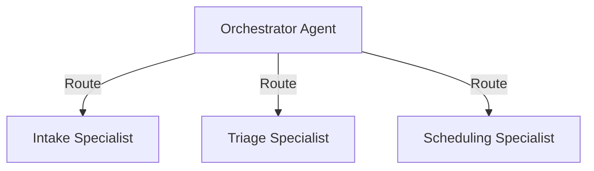

# ADR-002: Orchestrator/Worker Agent Pattern

## Context & Problem Statement
Modern multi-agent architectures often utilize peer-to-peer swarm patterns where agents communicate freely. While flexible, this non-deterministic routing is highly problematic in healthcare, where clear responsibility and structured audit trails are regulatory prerequisites.

## Decision
Zara OS will implement a strict **Orchestrator/Worker (Supervisor)** pattern for all patient workflows.

## Consequences
- **Pros:** Completely predictable data flow, single point of failure capture, and deterministic compliance hooks.
- **Cons:** Slightly higher prompt tokens consumed by the Orchestrator.
- **Compliance:** Provides clear tracking of which agent triggered which tool, matching standard clinical lineage requirements.
